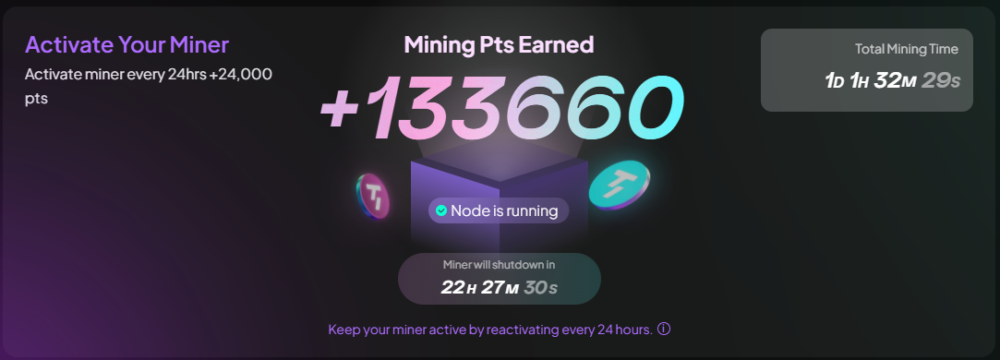

# Taker Bot Auto Activate Daily Mining



## How ?

- Register here using new wallet: [https://taker.xyz](https://earn.taker.xyz?start=8KZPY)
- Bind your X/Twitter otherwise you can't start mining
- Wait till you get faucet reward (0.001 TAKER) to start using bot

## Requirements

- **Node.js**: Ensure you have Node.js installed.
- **npm**: Ensure you have npm installed.
- **Taker Balance**: Ensure you have a balance in your Taker wallet.

## Setup

1. Clone this repository:
   ```bash
   git clone https://github.com/Zlkcyber/takerBot.git
   cd takerBot
   ```
2. Install dependencies:
   ```bash
   npm install
   ```
3. Fill your wallet detail at `wallets.json` you can view format in `wallets-example.json`
    ```bash
    nano wallets.json
    ```
4. Run The Script:
   ```bash
   npm run start
   ```

## 

This project is licensed under the [MIT License](LICENSE).
